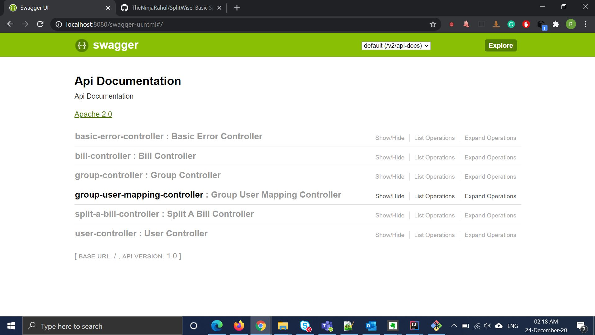
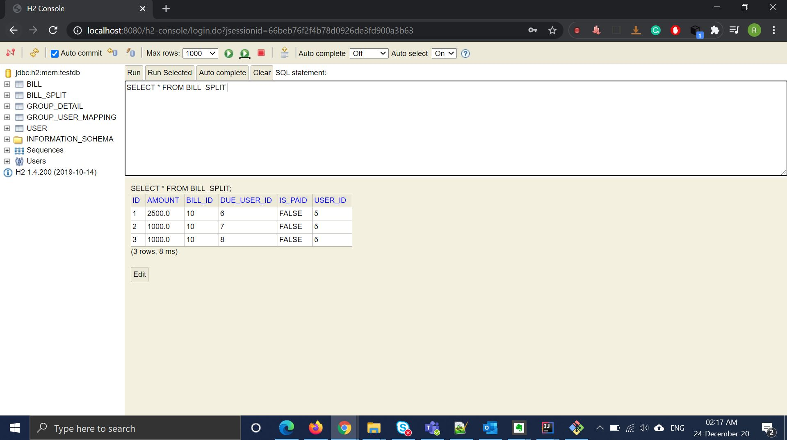

# SplitWise
Basic SplitWise Operation 

SplitWise:
=======================
1) Add user (name, email_id,username,password)  -- doable 
2) creatBill(groupID,BillAmouont,currentUser)   -- doable 
3) createBill(userIdsList{id1,id2},Amount,currentUser)  -- doable 
4) createGroup (useList{id1,id2....});  -- doable 
5) SSO (goodle,facebook)
6) fetchMyDetails(userId) - >  -- doable 
7) percentWiseDistribution( {{userid,%},{userid,%}...},amount)  -- doable 

 
In Memory DataBase: 
------------------
User{ id,name, email_id,username,password}
group{groupId,Name,userId}
groupMember(groupId,userid}
bill {id,amount,desc}
userOwe{userId,toUser,Amount,billId}

I have created SplitWise APIs that will be used to split the bill.

As you can see in the console I have created a different kind of controller based on their use cases.
User Controller:

This controller will be used to perform CRUD on Users, It will also collect data of particular user like how much amount I need to give to which users and how much amount I need to take back from other users.

I have used @query and join table in the code itself to fetch data in a custom format.

GroupController:
This controller will be used to perform CRUD on the Group Entity.

UserGroupMappingController:
This controller will be used to create a mapping for one group to another user. 

  Enhancement: while creating a group we can pass the list of users.
               We can pass the list of users at the same time while requesting to map this user to the group.
               
BillController:
  This controller will be used to create a Bill and perform CRUD on it.
  Enhancement: while creating a bill we can pass the list of users and split method.
               
  As of now, I have created a separate bill.
  
Split A Bill Controller:
   This controller will be used to split a Bill in the group equally or wanted to split the bill percentage-wise. 
    
    Enhancement: As of now split bill requires amount and bill id but in the future, we can directly fetch the amount given bill id.
    
    Group split Logic:
    Fetch GroupSize, divice amount with size and store it into the split table.
    
    Percentage Wise Logic:
    Parameters will in form of array where odd postion will be user id and evenPosition will be its percentage.
    and calculate the percentage wise and store the data into the split table.
   
Exception Handler Controller:
  This controller will be used when any custom exceptions occurred in our system.
  I am using ResponseEntity as a response when an exception occurs.
  
I have created unit Test cases as well for each kind of service. 
  Enhancement: Many test cases are missing.

I am using ResponseEntity as a response when an exception occurs.

I have used @query and join table in code itself to get the data.

<b>In Memory Database (H2)</b>

